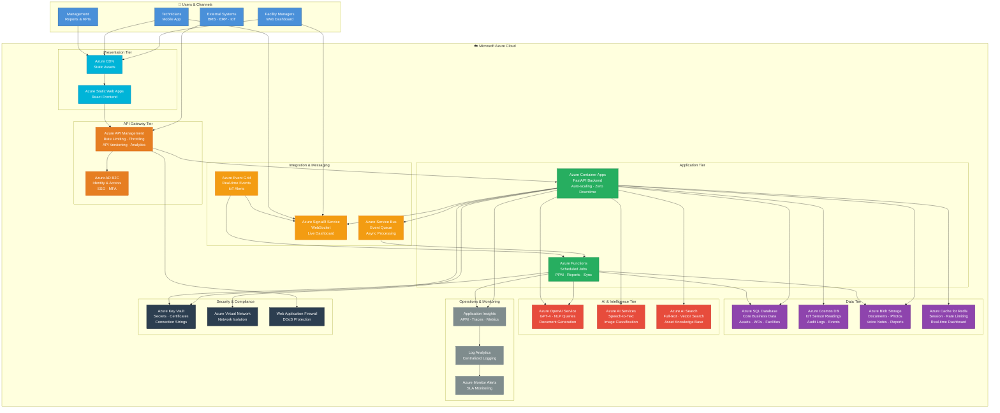
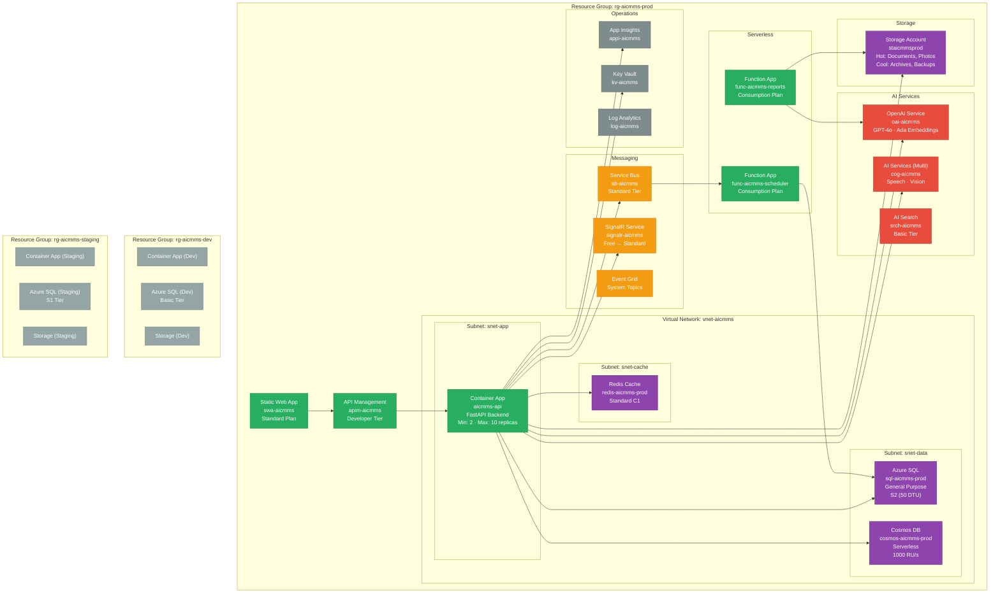
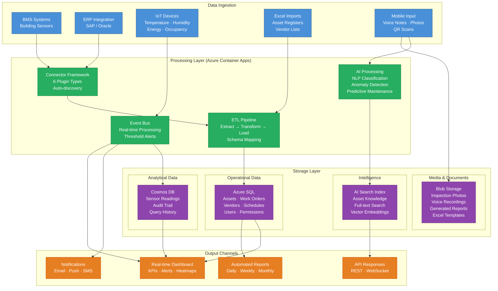
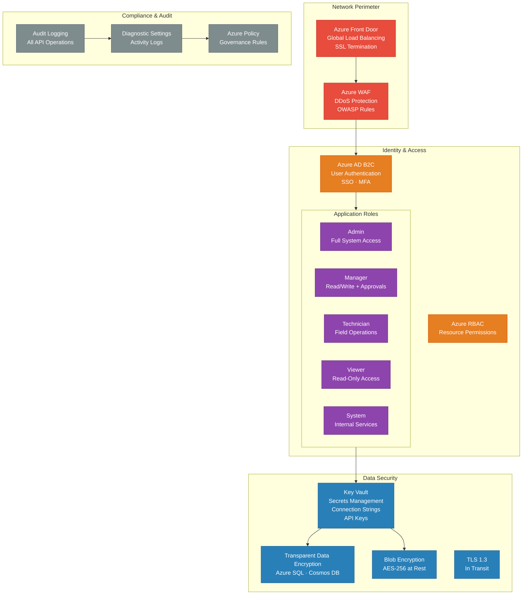
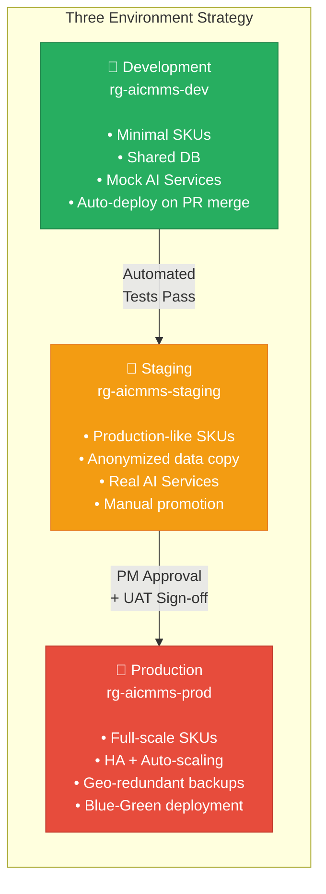

# AICMMS — Azure Cloud Architecture

> **AI-native Computer Maintenance Management System**
> Prepared for: Project Management & Stakeholders
> Platform: Microsoft Azure

---

## 1. Solution Overview

---

## 2. Application Architecture — Layered View

```mermaid
graph TB
    subgraph L1["🌐 Presentation Layer"]
        direction LR
        WEB["React Web App<br/>Azure Static Web Apps"]
        MOBILE["Mobile App<br/>(Flutter / React Native)"]
        SWAGGER["API Docs<br/>Swagger / ReDoc"]
    end

    subgraph L2["🔐 API Gateway"]
        direction LR
        APIM["Azure API Management<br/>Versioning · Rate Limits · Analytics"]
        AUTH["Azure AD B2C<br/>JWT · RBAC · 5 Roles"]
    end

    subgraph L3["⚙️ Application Layer — FastAPI on Azure Container Apps"]
        direction TB

        subgraph ROUTES["16 API Endpoint Groups"]
            direction LR
            R1["Assets · Work Orders<br/>Technicians · Dashboard"]
            R2["Facilities · Maintenance<br/>Inspections · Vendors"]
            R3["Costs · Documents<br/>Sensors · Gamification"]
            R4["Query · Occupancy<br/>Connectors · Health"]
        end

        subgraph SVC["15 Service Modules"]
            direction LR
            SV1["AssetService<br/>WorkOrderService<br/>TechnicianService"]
            SV2["MaintenanceService<br/>InspectionService<br/>FacilityService"]
            SV3["CostService<br/>DocumentService<br/>VendorService"]
            SV4["SensorService<br/>GamificationService<br/>QueryService"]
        end

        subgraph DOMAIN["Domain Model — 13 Entity Groups · 50+ Models"]
            direction LR
            DM1["Assets · Work Orders<br/>Facilities · Maintenance"]
            DM2["Inspections · Technicians<br/>Vendors · Costs"]
            DM3["Documents · Sensors<br/>Gamification · Occupancy"]
        end
    end

    subgraph L4["💾 Data Access Layer"]
        direction LR
        REPO["Repository Pattern<br/>SQL · Mongo · File"]
        CONN["6 Connector Plugins<br/>PostgreSQL · MySQL · MSSQL<br/>MongoDB · CSV · Excel"]
        PIPE["ETL Pipeline Engine<br/>Extract → Transform → Load"]
    end

    subgraph L5["🗄️ Data & Storage Layer"]
        direction LR
        SQL["Azure SQL Database<br/>Relational Data"]
        COSM["Cosmos DB<br/>NoSQL / IoT"]
        BLOBS["Blob Storage<br/>Files & Media"]
        CACHE["Redis Cache<br/>Sessions"]
    end

    subgraph L6["🤖 AI & Intelligence"]
        direction LR
        GPT["Azure OpenAI (GPT-4)<br/>NLP Query · Document Gen"]
        SPEECH["Azure AI Speech<br/>Voice Note Transcription"]
        VISION["Azure AI Vision<br/>Photo Classification"]
        SEARCH["Azure AI Search<br/>Knowledge Base"]
    end

    L1 --> L2 --> L3
    ROUTES --> SVC --> DOMAIN
    L3 --> L4 --> L5
    L3 --> L6

    classDef l1Style fill:#00B4D8,stroke:#0077B6,color:#fff
    classDef l2Style fill:#E67E22,stroke:#D35400,color:#fff
    classDef l3Style fill:#27AE60,stroke:#1E8449,color:#fff
    classDef l4Style fill:#2980B9,stroke:#1F618D,color:#fff
    classDef l5Style fill:#8E44AD,stroke:#6C3483,color:#fff
    classDef l6Style fill:#E74C3C,stroke:#C0392B,color:#fff

    class WEB,MOBILE,SWAGGER l1Style
    class APIM,AUTH l2Style
    class R1,R2,R3,R4,SV1,SV2,SV3,SV4,DM1,DM2,DM3 l3Style
    class REPO,CONN,PIPE l4Style
    class SQL,COSM,BLOBS,CACHE l5Style
    class GPT,SPEECH,VISION,SEARCH l6Style
```

---

## 3. Azure Deployment Architecture

---

## 4. CI/CD Pipeline — Azure DevOps

```mermaid
graph LR
    subgraph DEV["Developer Workflow"]
        CODE["Code Push<br/>GitHub / Azure Repos"]
        PR["Pull Request<br/>Code Review"]
    end

    subgraph CI["Continuous Integration"]
        BUILD["Build & Test<br/>Python 3.12<br/>162 Unit Tests"]
        LINT["Linting & Security<br/>Ruff · Bandit · Safety"]
        DOCKER["Docker Build<br/>Multi-stage Image<br/>~150MB Final"]
        ACR["Push to ACR<br/>Azure Container Registry"]
    end

    subgraph CD_DEV["Deploy → Dev"]
        DEV_DEPLOY["Container Apps (Dev)<br/>Auto-deploy on merge"]
        DEV_TEST["Integration Tests<br/>API Smoke Tests"]
    end

    subgraph CD_STG["Deploy → Staging"]
        STG_DEPLOY["Container Apps (Staging)<br/>Manual Approval Gate"]
        STG_TEST["E2E Tests<br/>Load Tests"]
    end

    subgraph CD_PROD["Deploy → Production"]
        PROD_APPROVE["PM Approval Gate<br/>Change Advisory Board"]
        PROD_DEPLOY["Container Apps (Prod)<br/>Blue-Green Deployment<br/>Zero Downtime"]
        PROD_VERIFY["Health Check<br/>Canary Validation"]
    end

    CODE --> PR --> BUILD --> LINT --> DOCKER --> ACR
    ACR --> DEV_DEPLOY --> DEV_TEST
    DEV_TEST --> STG_DEPLOY --> STG_TEST
    STG_TEST --> PROD_APPROVE --> PROD_DEPLOY --> PROD_VERIFY

    classDef devStyle fill:#4A90D9,stroke:#2C5F8A,color:#fff
    classDef ciStyle fill:#E67E22,stroke:#D35400,color:#fff
    classDef cdDev fill:#27AE60,stroke:#1E8449,color:#fff
    classDef cdStg fill:#F39C12,stroke:#E67E22,color:#fff
    classDef cdProd fill:#E74C3C,stroke:#C0392B,color:#fff

    class CODE,PR devStyle
    class BUILD,LINT,DOCKER,ACR ciStyle
    class DEV_DEPLOY,DEV_TEST cdDev
    class STG_DEPLOY,STG_TEST cdStg
    class PROD_APPROVE,PROD_DEPLOY,PROD_VERIFY cdProd
```

---

## 5. Data Flow Architecture

---

## 6. Security Architecture

---

## 7. MVP User Stories → Azure Services Mapping

| # | User Story | Application Layer | Azure Services |
|---|-----------|-------------------|----------------|
| 1 | **Data Source Connectors** | ConnectorService + 6 Plugins | Azure SQL · Cosmos DB · Blob Storage |
| 2 | **FM Command Center** | DashboardService + FacilityService | SignalR (live) · Redis (cache) · App Insights |
| 3 | **PPM Scheduling** | MaintenanceService | Azure Functions (scheduler) · Service Bus |
| 4 | **NLP Query Interface** | QueryService | Azure OpenAI GPT-4o · AI Search |
| 5 | **Ad-hoc Work Orders** | WorkOrderService | Azure SQL · Service Bus (notifications) |
| 6 | **Excel-native UI** | DocumentService | Blob Storage · Azure SQL |
| 7 | **Excel Import** | DocumentService + ETL Pipeline | Blob Storage · Azure Functions |
| 8 | **Native Asset Onboarding** | AssetService (QR Gen) | Azure SQL · Blob Storage |
| 9 | **Document Templates** | DocumentService | Azure OpenAI (generation) · Blob Storage |
| 10 | **FM Reporting** | DocumentService + Scheduler | Azure Functions (cron) · Blob Storage |
| 11 | **Sub-Vendor Management** | VendorService | Azure SQL · Service Bus |
| 12 | **WO → Commercial Journey** | CostService | Azure SQL · App Insights (tracking) |
| 13 | **Manpower Registry** | TechnicianService | Azure SQL · AI Search (skill matching) |
| 14 | **Inspection Reports** | InspectionService | AI Speech (voice) · AI Vision (photos) · Blob |
| 15 | **Gamified Self-Entry** | GamificationService | Azure SQL · SignalR (leaderboard) |
| 16 | **QR Scan Insights** | InspectionService | Azure OpenAI (classify) · Cosmos DB |

---

## 8. Azure Cost Estimation (Monthly)

### MVP Phase — Development & Testing

| Azure Service | SKU / Tier | Est. Monthly Cost |
|--------------|-----------|-------------------|
| Container Apps | Consumption (2 replicas) | ~$50–100 |
| Azure SQL Database | Basic (5 DTU) | ~$5 |
| Cosmos DB | Serverless (400 RU/s) | ~$25 |
| Blob Storage | Hot (50 GB) | ~$2 |
| Redis Cache | Basic C0 | ~$16 |
| Azure OpenAI | Pay-per-use (GPT-4o) | ~$30–60 |
| AI Services | Pay-per-use | ~$10–20 |
| AI Search | Free Tier | $0 |
| Service Bus | Basic | ~$0.05 |
| SignalR | Free (20 connections) | $0 |
| API Management | Consumption | ~$3.50/million calls |
| Static Web Apps | Free | $0 |
| Key Vault | Standard | ~$0.03/operation |
| App Insights | First 5 GB free | $0 |
| **Total MVP/Dev** | | **~$150–250/month** |

### Production Phase — Full Scale

| Azure Service | SKU / Tier | Est. Monthly Cost |
|--------------|-----------|-------------------|
| Container Apps | Dedicated (2–10 replicas) | ~$200–500 |
| Azure SQL Database | S2 General Purpose (50 DTU) | ~$75 |
| Cosmos DB | Provisioned (1000 RU/s) | ~$60 |
| Blob Storage | Hot (500 GB) + Cool (1 TB) | ~$25 |
| Redis Cache | Standard C1 | ~$80 |
| Azure OpenAI | GPT-4o (moderate usage) | ~$100–300 |
| AI Services | Speech + Vision | ~$50–100 |
| AI Search | Basic (15 GB index) | ~$75 |
| Service Bus | Standard | ~$10 |
| SignalR | Standard (1000 connections) | ~$50 |
| API Management | Developer | ~$50 |
| Static Web Apps | Standard | ~$9 |
| Azure Front Door | Standard | ~$35 |
| Key Vault | Standard | ~$5 |
| App Insights | 10 GB/month | ~$25 |
| **Total Production** | | **~$850–1,400/month** |

> **Note:** Costs are estimates based on Azure pricing as of 2026. Actual costs depend on usage patterns, data volume, and API call frequency.

---

## 9. Environment Strategy

---

## 10. Project Metrics (Current Status)

| Metric | Value |
|--------|-------|
| **Total Source Files** | 100+ |
| **Lines of Code** | 12,000+ |
| **API Endpoints** | 16 route groups, 80+ endpoints |
| **Service Modules** | 15 |
| **Domain Models** | 50+ (13 entity groups) |
| **Connector Plugins** | 6 (PostgreSQL, MySQL, MSSQL, MongoDB, CSV, Excel) |
| **Unit Tests** | 162 passing |
| **Test Coverage** | Core services, schemas, middleware, WebSocket |
| **MVP Stories Covered** | 16/16 (API layer complete) |
| **Git Commits** | 6 on master |

### Build Status

| Component | Status |
|-----------|--------|
| Core Platform | ✅ Complete |
| Connector Framework | ✅ Complete (6 plugins) |
| Schema Discovery | ✅ Complete |
| Domain Models | ✅ Complete (50+ models) |
| Repository Layer | ✅ Complete |
| Integration Engine | ✅ Complete (ETL + Scheduler) |
| AI Foundation | ✅ Complete (interfaces + embeddings) |
| API Layer | ✅ Complete (all 16 stories) |
| Service Layer | ✅ Complete (15 services) |
| Unit Tests | ✅ 162 passing |
| Frontend | 🔲 Not started |
| Azure Deployment | 🔲 Not started |
| E2E Tests | 🔲 Not started |

---

## 11. Key Design Decisions

| Decision | Choice | Rationale |
|----------|--------|-----------|
| **Backend Framework** | FastAPI (Python) | Async-native, auto-docs, Pydantic validation, fast development |
| **Cloud Platform** | Microsoft Azure | Enterprise-grade, AI services, compliance certifications |
| **Container Orchestration** | Azure Container Apps | Serverless containers, auto-scaling, simpler than AKS |
| **Primary Database** | Azure SQL | Relational integrity for core business data, familiar tooling |
| **NoSQL / IoT Store** | Cosmos DB | Serverless scaling for high-volume sensor data |
| **Real-time Updates** | Azure SignalR | Managed WebSocket, scales to thousands of connections |
| **AI/NLP Engine** | Azure OpenAI (GPT-4o) | Best-in-class NLP, native Azure integration |
| **Authentication** | Azure AD B2C | Enterprise SSO, MFA, social login, RBAC |
| **Job Scheduling** | Azure Functions | Consumption pricing, event-driven, timer triggers |
| **API Gateway** | Azure API Management | Rate limiting, versioning, analytics, developer portal |
| **Secrets Management** | Azure Key Vault | HSM-backed, access policies, rotation support |

---

## 12. Non-Functional Requirements

| Requirement | Target | Azure Service |
|------------|--------|---------------|
| **Availability** | 99.9% SLA | Container Apps + Azure SQL (zone redundant) |
| **Response Time** | < 200ms (p95) | Redis Cache + Container Apps auto-scale |
| **Concurrent Users** | 500+ simultaneous | SignalR Standard + Container Apps (10 replicas) |
| **Data Retention** | 7 years | Blob Storage (Cool/Archive tier) |
| **Backup RPO** | 1 hour | Azure SQL point-in-time restore |
| **Backup RTO** | 4 hours | Geo-redundant backups |
| **Security** | SOC 2, ISO 27001 | Azure compliance certifications |
| **Scalability** | Auto-scale 2–10 instances | Container Apps scaling rules |
| **Monitoring** | Real-time APM | Application Insights + Log Analytics |
