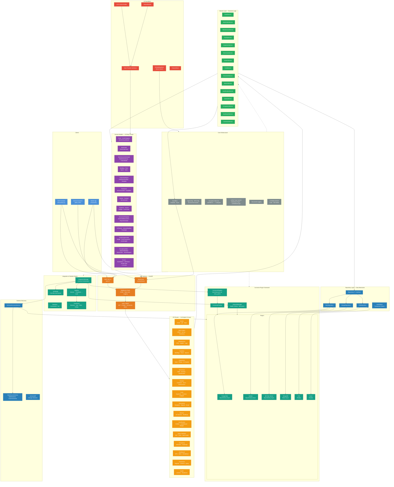
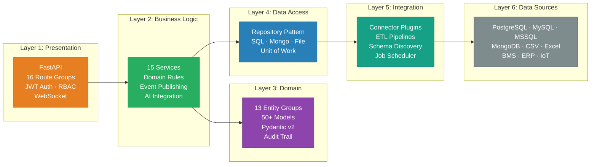
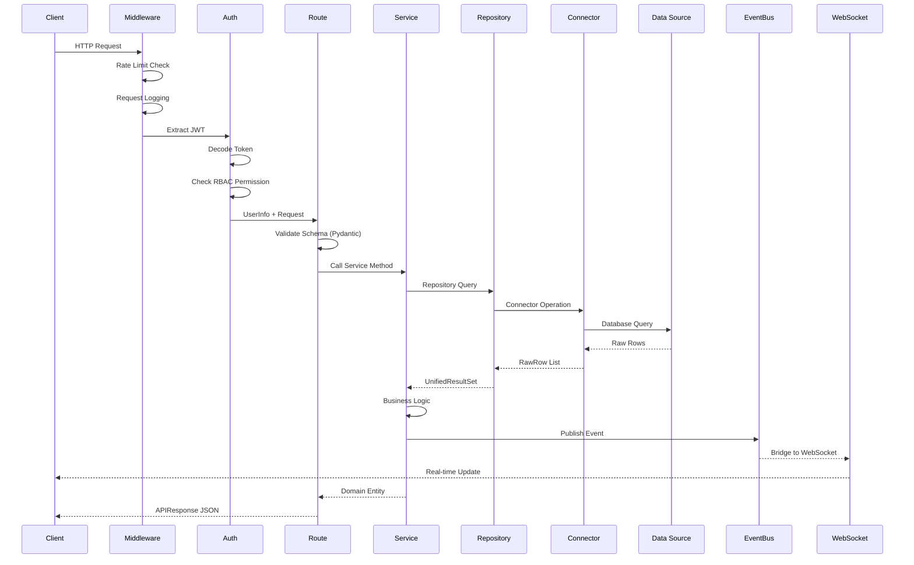
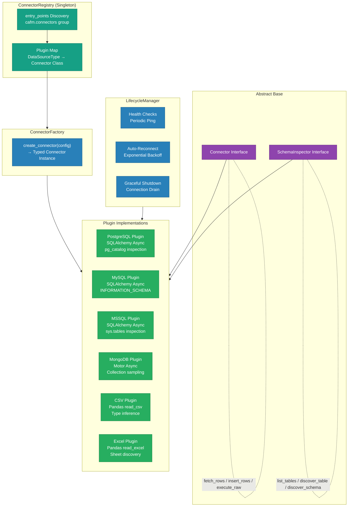
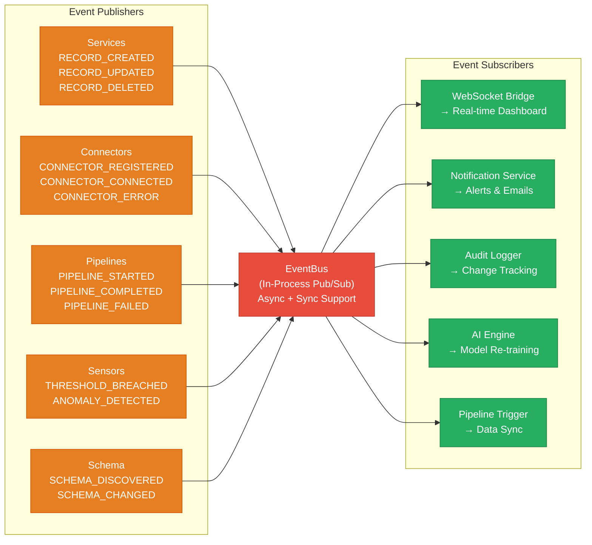
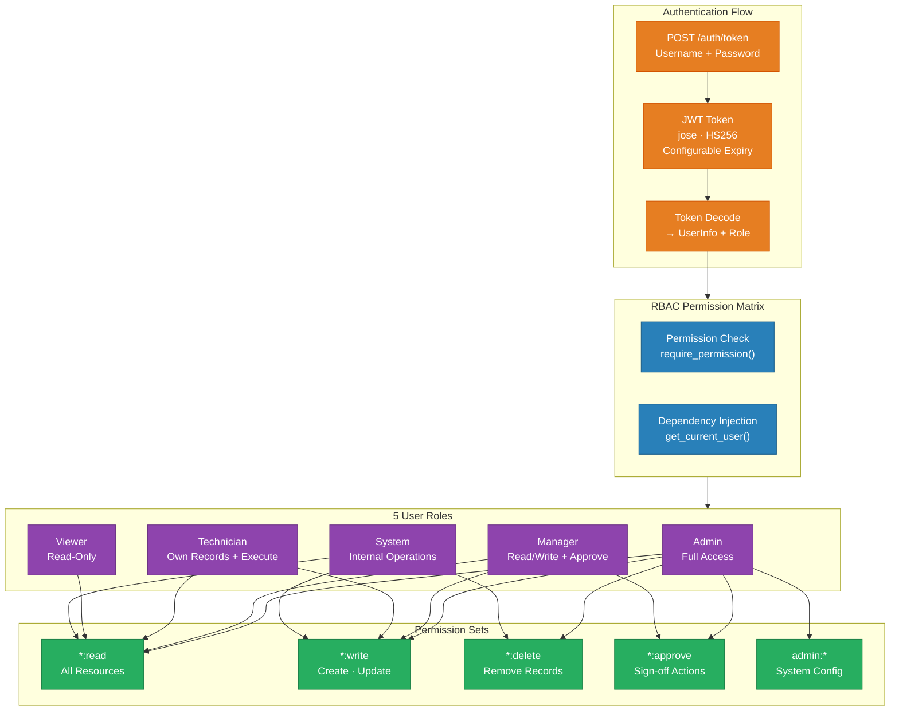
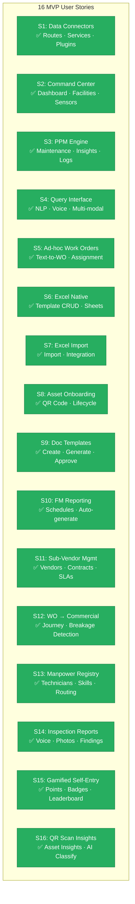
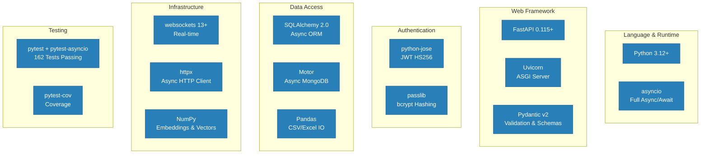

# AICMMS Architecture

## High-Level System Architecture



## Layered Architecture (Simplified)



## Data Flow — API Request Lifecycle



## Connector Plugin Architecture



## Event-Driven Architecture



## Authentication & Authorization Flow



## MVP User Stories Coverage Map



## Technology Stack



## Directory Structure

```
AICMMS/
├── pyproject.toml                     # Project config & dependencies
├── src/cafm/
│   ├── api/                           # ── Layer 1: Presentation ──
│   │   ├── app.py                     #   FastAPI factory + lifespan
│   │   ├── config.py                  #   API configuration
│   │   ├── auth.py                    #   JWT + RBAC
│   │   ├── dependencies.py            #   DI container
│   │   ├── middleware.py              #   CORS, rate-limit, logging
│   │   ├── websocket.py              #   Real-time event bridge
│   │   ├── routes/                    #   16 endpoint groups
│   │   │   ├── assets.py, work_orders.py, facilities.py
│   │   │   ├── inspections.py, maintenance.py, documents.py
│   │   │   ├── costs.py, gamification.py, sensors.py
│   │   │   ├── technicians.py, vendors.py, occupancy.py
│   │   │   ├── dashboard.py, query.py, connectors.py
│   │   │   └── auth.py, health.py
│   │   └── schemas/                   #   Pydantic request/response models
│   │       ├── common.py, assets.py, work_orders.py
│   │       ├── maintenance.py, technicians.py, facilities.py
│   │       ├── dashboard.py, connectors.py, vendors.py
│   │       ├── inspections.py, costs.py, sensors.py
│   │       └── documents.py, gamification.py
│   │
│   ├── services/                      # ── Layer 2: Business Logic ──
│   │   ├── asset_service.py           #   15 service modules
│   │   ├── work_order_service.py      #   encapsulating domain rules
│   │   └── ...                        #   (see full list above)
│   │
│   ├── domain/                        # ── Layer 3: Domain Model ──
│   │   ├── assets.py, work_orders.py  #   13 entity groups, 50+ models
│   │   ├── enums.py                   #   20+ shared enumerations
│   │   └── ...                        #   All inherit CAFMBaseModel
│   │
│   ├── repository/                    # ── Layer 4: Data Access ──
│   │   ├── base.py                    #   Repository<T> interface
│   │   ├── sql_repository.py          #   SQL backends (PG/MySQL/MSSQL)
│   │   ├── mongo_repository.py        #   MongoDB backend
│   │   ├── file_repository.py         #   CSV/Excel backend
│   │   └── unit_of_work.py            #   Transaction patterns
│   │
│   ├── integration/                   # ── Layer 5: Integration ──
│   │   ├── manager.py                 #   Central orchestrator
│   │   ├── pipeline.py                #   ETL: extract→transform→load
│   │   ├── scheduler.py               #   Cron-like job runner
│   │   ├── sync.py                    #   Data synchronization
│   │   └── transforms.py              #   Field mapping & transforms
│   │
│   ├── connectors/                    # ── Layer 5b: Connector Plugins ──
│   │   ├── base.py                    #   Connector + SchemaInspector ABC
│   │   ├── registry.py                #   Plugin auto-discovery
│   │   ├── lifecycle.py               #   Health checks & reconnect
│   │   ├── factory.py                 #   Instance creation
│   │   └── plugins/                   #   6 connector implementations
│   │       ├── postgresql/
│   │       ├── mysql/
│   │       ├── mssql/
│   │       ├── mongodb/
│   │       ├── csv_source/
│   │       └── excel/
│   │
│   ├── schema/                        # ── Schema Discovery ──
│   │   ├── models.py                  #   DataSourceSchema hierarchy
│   │   ├── discovery.py               #   Auto-discovery + caching
│   │   ├── diff.py                    #   Schema change detection
│   │   └── serialization.py           #   JSON serialization
│   │
│   ├── models/                        # ── Unified Data Model ──
│   │   ├── base.py                    #   CAFMBaseModel (audit, soft-delete)
│   │   ├── record.py                  #   UnifiedRecord + RecordMetadata
│   │   ├── resultset.py               #   UnifiedResultSet (paginated)
│   │   └── mapping.py                 #   Field mapping utilities
│   │
│   ├── core/                          # ── Core Infrastructure ──
│   │   ├── config.py                  #   AppConfig (env-based)
│   │   ├── events.py                  #   EventBus (pub/sub, async)
│   │   ├── exceptions.py              #   CAFMError hierarchy
│   │   ├── types.py                   #   DataSourceType, UnifiedDataType
│   │   └── logging.py                 #   Structured logging
│   │
│   └── ai/                            # ── AI Foundation ──
│       ├── interfaces.py              #   Data provider contracts
│       ├── context.py                 #   LLM context builder
│       ├── dataset_builder.py         #   Training data assembly
│       ├── embedding_store.py         #   Vector search (NumPy)
│       └── feature_store.py           #   Computed feature cache
│
└── tests/
    └── unit/                          # 162 tests passing
        ├── test_api_config.py         #   12 tests — config, JWT, RBAC
        ├── test_api_schemas.py        #   17 tests — schema validation
        ├── test_services.py           #   15 tests — core services
        ├── test_new_services.py       #   33 tests — all new services
        ├── test_new_schemas.py        #   22 tests — new schema validation
        ├── test_middleware.py         #   8 tests — error mapping
        ├── test_websocket.py          #   7 tests — connection manager
        ├── test_domain_models.py      #   10 tests — domain entities
        ├── test_transforms.py         #   8 tests — ETL transforms
        └── ... (more test modules)
```

## Design Patterns Used

| Pattern | Where | Purpose |
|---------|-------|---------|
| Repository | `repository/base.py` | Abstract data access across SQL/Mongo/File backends |
| Service Layer | `services/*.py` | Encapsulate business rules between routes and repos |
| Dependency Injection | `api/dependencies.py` | Singleton management and testable composition |
| Plugin Registry | `connectors/registry.py` | Dynamic connector discovery via `entry_points` |
| Factory | `connectors/factory.py` | Create typed connector instances from config |
| Pub/Sub Event Bus | `core/events.py` | Decoupled inter-component communication |
| Template Method | `connectors/base.py` | Standard connector lifecycle with extension points |
| Chain of Responsibility | `integration/pipeline.py` | Composable ETL transform chains |
| Unit of Work | `repository/unit_of_work.py` | Transaction boundary management |
| Adapter | `models/mapping.py` | Unified interface over heterogeneous data sources |
| Singleton | `ConnectorRegistry`, `EventBus` | Thread-safe shared state |
| Strategy | `ai/interfaces.py` | Swappable AI data provider implementations |
